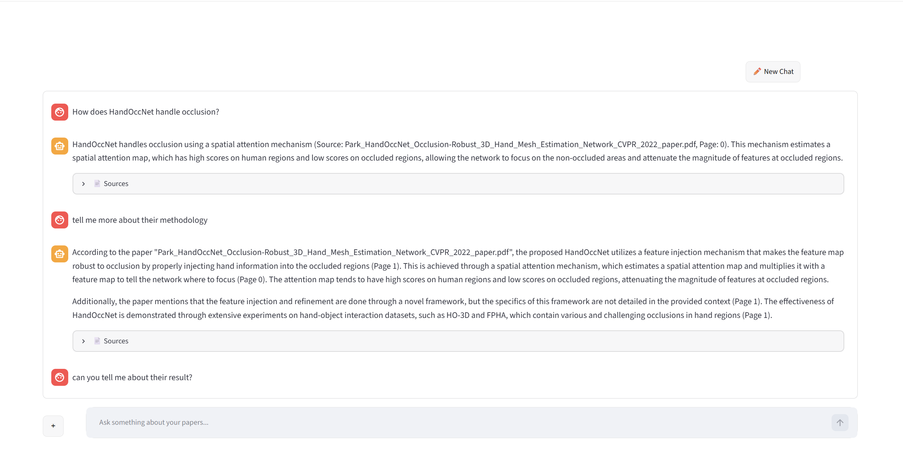
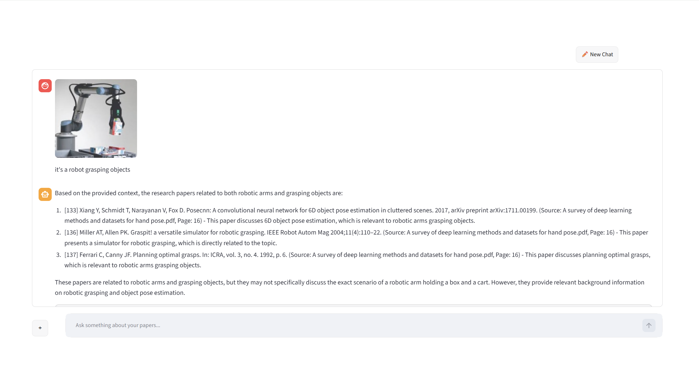

# VisualRAG — Multimodal Research Assistant for Computer Vision Papers

A RAG-powered research assistant that answers questions grounded in a personal collection of computer vision and robotics papers. Supports both **text queries** and **image queries** — upload an image and get back relevant papers and a grounded answer. Every response is cited with paper filename and page number.

---

## Demo

<!-- Add screenshot or GIF here -->

---

## What it does

- Ask a natural language question about computer vision or robotics
- **Or upload an image** — a robot gripper, a depth map, a segmentation result — and get relevant papers back
- Remembers previous questions in the same session for follow-up conversations
- Every answer is grounded in your paper collection with citations — no hallucination
- If the answer isn't in the corpus, the system says so explicitly

---

## Architecture

```
User Input
    │
    ├── Text query ──────────────────────────────────────┐
    │                                                     │
    └── Image → BLIP-2 captioner                         │
                generates text description               │
                        │                                │
                        ▼                                ▼
               "Computer vision research related to: {caption}"
                                         │
                                         ▼
                        Embedding Model (all-mpnet-base-v2)
                                         │
                                         ▼
                        ChromaDB Vector Store
                        23 papers · ~1500 chunks
                        MMR retrieval (k=4, fetch_k=12)
                                         │
                                         ▼
                        Groq LLM (Llama 3.1 8B)
                        grounded prompt · no hallucination
                                         │
                                         ▼
                        Answer + Citations
                        paper filename · page number
```

---

## Stack

| Component | Tool |
|---|---|
| PDF loading & chunking | LangChain + PyPDFLoader |
| Text splitting | RecursiveCharacterTextSplitter (1000 chars, 200 overlap) |
| Embeddings | HuggingFace `sentence-transformers/all-mpnet-base-v2` |
| Vector store | ChromaDB (local, persistent) |
| Retrieval strategy | MMR — Maximum Marginal Relevance |
| Image captioning | BLIP-2 (`Salesforce/blip2-opt-2.7b`) |
| LLM | Llama 3.1 8B via Groq API (free) |
| Orchestration | LangChain LCEL |
| Interface | Streamlit |
| Deployment | Hugging Face Spaces (coming soon) |

---

## Paper Corpus (23 papers)

The corpus focuses on hand-object interaction, pose estimation, and object detection:

- Hand pose estimation and reconstruction surveys
- Hand-object interaction datasets (HOI4D, AffordPose, H2O, SHOWMe)
- 3D reconstruction methods (PhysTwin, MagicHOI, HOIDiffusion)
- Object detection baselines (YOLO)
- Depth camera documentation (Intel RealSense D400)

---

## Example — Text Query

**Q:** Tell me about the YOLO paper

**A:** The YOLO paper introduces a unified model for object detection that can process streaming video with less than 25 milliseconds of latency. YOLO achieves more than twice the mean average precision of other real-time systems. The system predicts multiple bounding boxes per grid cell and assigns one predictor to be responsible for each object based on the highest current IOU with the ground truth. When combined with Fast R-CNN, YOLO provides a 2.3% boost in mean average precision on PASCAL VOC 2012.

**Sources:** `Yolo.pdf — Page 0`, `Yolo.pdf — Page 2`, `Yolo.pdf — Page 6`

---

## Example — Follow-up (Memory)

**Q:** What is it's method?

**A:** YOLO introduces a unified model for object detection, trained directly on full images using a loss function that directly corresponds to detection performance. Unlike classifier-based approaches, the entire model is trained jointly, allowing YOLO to reason globally about the image...

**Sources:** `Yolo.pdf — Page 0`, `Yolo.pdf — Page 7`

---

## Example — Image Query

**Uploaded image:** Hand gesture photos

**BLIP-2 sees:** "a series of images showing different types of hand gestures"

**Top source:** `A survey of deep learning methods and datasets for hand pose.pdf`

**A:** Research related to hand gesture recognition can be found in the hand pose estimation literature. According to the survey paper, hand gesture recognition involves capturing hand movements and classifying them into predefined categories...

<!-- Add screenshot here -->

---

## Evaluation

### Text Retrieval — 10 questions with known answers

**Score: 8/10**

| Question | Result |
|---|---|
| mAP of Fast YOLO on PASCAL VOC 2007? | ✓ |
| PhysTwin core representation? | ✓ |
| HOPE-Net evaluation dataset? | ✓ |
| HOI4D main contribution? | ✓ |
| HandOccNet occlusion handling? | ✓ |
| AffordPose main task? | ✓ |
| HOIDiffusion data generation? | ✓ |
| SHOWMe benchmark method? | ✓ |
| RealSense sensor discussion? | ✗ |
| HO-3D dataset backbone? | ✗ |

### Image Retrieval — 4 test images

**Score: 2/4**

| Image | Caption | Retrieval |
|---|---|---|
| Robot arm grasping | ✓ Accurate | ✗ Corpus lacks industrial robotics papers |
| Hand gestures | ✓ Accurate | ✓ Correct papers retrieved |
| Segmentation mask | ✓ Accurate | ✓ Correct papers retrieved |
| RealSense camera | ✗ Misidentified as thermometer | ✗ Wrong retrieval |

---

## Setup

**Prerequisites:** Python 3.10+, a free [Groq API key](https://console.groq.com)

```bash
git clone https://github.com/yourusername/visualrag.git
cd visualrag

python -m venv venv
venv\Scripts\activate        # Windows
source venv/bin/activate     # Mac/Linux

pip install -r requirements.txt
```

Create a `.env` file in the project root:

```
GROQ_API_KEY=your_key_here
HF_HOME=E:\huggingface_cache   # optional: redirect model cache away from C: drive
```

Place your PDF papers in `data/papers/`, then build the vector store — one time only, takes ~15 minutes:

```bash
python src/retrieval.py
```

Run the app:

```bash
streamlit run app.py
```

---

## Project Structure

```
visualrag/
├── data/
│   ├── papers/              ← PDF papers
│   └── test_images/         ← test images for evaluation
├── notebooks/
│   ├── 01_retrieval_pipeline.ipynb   ← text RAG testing
│   └── 02_image_input.ipynb          ← image query testing
├── src/
│   ├── ingestion.py         ← PDF loading, chunking, cleaning
│   ├── retrieval.py         ← ChromaDB vector store
│   ├── rag_chain.py         ← LLM + RAG chain + image query
│   └── image_captioner.py   ← BLIP-2 image captioning
├── app.py                   ← Streamlit UI
├── chroma_db/               ← auto-generated, gitignored
└── .env                     ← API keys, gitignored
```

---

## Known Limitations

- Scanned PDFs with no text layer will not be indexed
- Image captioning works best for common visual content — specialized equipment like depth cameras can be misidentified
- Image retrieval quality depends on corpus coverage — queries about topics not in the corpus will not retrieve well
- Specific factual queries retrieve better than broad conceptual ones
- Running on CPU: BLIP-2 captioning takes ~30–60 seconds per image

---

## Why this project

Most RAG demos are text-only and use toy datasets. VisualRAG is built on a real research corpus and adds multimodal image input — a rare combination in portfolios. Technical decisions are all explainable:

- **MMR retrieval** over similarity search — reduces redundancy in retrieved chunks
- **all-mpnet-base-v2** over MiniLM — better semantic similarity for technical domain text
- **Chunk overlap** — prevents answers from being split across chunk boundaries
- **Grounded prompt** — forces citations and prevents hallucination
- **LaTeX cleaning** — removes encoded math from PDF chunks that pollute retrieval




